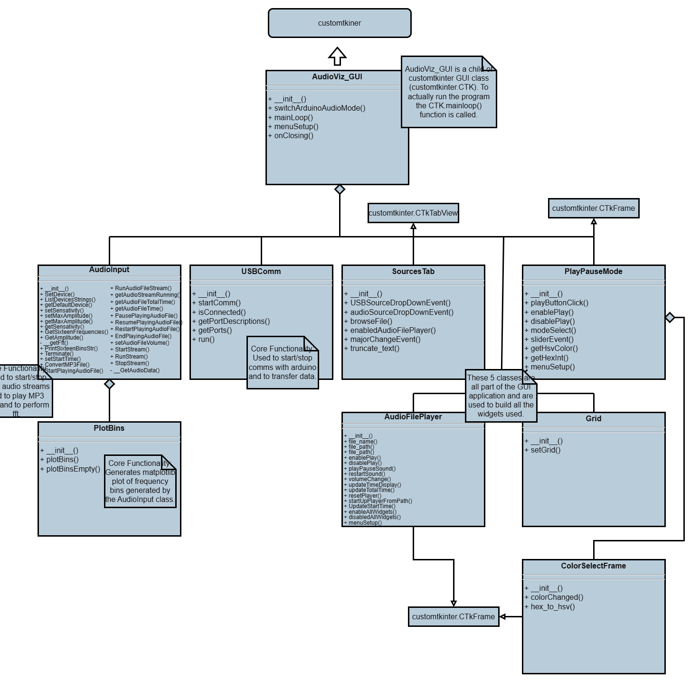
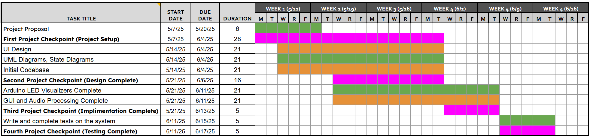
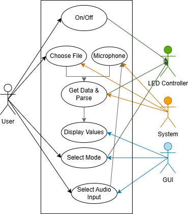

# Overview
This document describes the functional and non-functional requirements of the semester project for BTripleJ in CIS350. The project is an audio visualizer with a microcontroller and LED display along with a Python GUI and python audio processing. The functional requirements describe the functionality of the entire system, and the non-functional requirements outline some of the ways it may be implemented.

# Software Requirements
### GUI and System
Refers to the python application and some general requirements.

### Microcontroller & Display
Specifically refers to the Micriocontroller LED display and comms to the python application.

### Audio Input & Processing
Refers the part of the python application that does the audio input and processing.

## Functional Requirements
### GUI and System
| ID | Requirement |
| :-------------: | :----------: |
| FR1 | The system shall have a GUI that allows for controlling the audio visualizer. |
| FR2 | The system shall have a GUI to select a port for Arduino. |
| FR3 | The system shall allow the user to select a connected microphone. |
| FR4 | The system shall support different audio visualizations modes such as frequency and amplitude mode. |
| FR5 | The system shall notify the user if a serial port is unavailable. |
| FR6 | The system shall allow the user to easily start/stop data from passing. |
| FR7 | The system shall allow the user to adjust sensitivity for incoming input |
| FR8 | The system shall allow the user to control the color output on the LED through the GUI |
| FR9 | The system may use the Tkinter library for the GUI. |
| FR10 | The system may use prebuilt python packages. |
| … | … |

### Microcontroller & Display
| ID | Requirement |
| :-------------: | :----------: |
| FR1 | The system shall parse pitch and volume from serial data.  |
| FR2 | The system shall have an LED display for the audio visualization. |
| FR3 | The system shall be able to send serial data to a microcontroller. |
| FR4 | The system may use different color LEDs to denote different frequencies. |
| FR5 | The system may set a max and minimal brightness for the LEDs. |
| FR6 | The system shall power the LED reliably. |
| FR7 | The system shall use An Arduino microcontroller. |
| FR8 | The system may use the FastLED library. |
| … | … |

## Non-Functional Requirements
### GUI and System
| ID | Requirement |
| :-------------: | :----------: |
| NFR1 | The system may have a GUI that responds to the DPI of different monitors |
| NFR2 |  The system may stop visualization to the LED with one click on the GUI |
| NFR3 |  The system may be durable for prolonged use |
| NFR4 |  The system documentation may be understandable to someone with no knowledge of the system |
| NFR5 |  The system may operate continuously without crashing |
| NFR6 |  The system may have a GUI easy to understand, minimal, intuitive design layout 

### Microcontroller & Display
| ID | Requirement |
| :-------------: | :----------: |
| NFR1 | The system may be able to use an arduino microcontroller |
| NFR2 | The system may filter the serial inputs |
| NFR3 |  The system may be able to use an arduino microcontroller |
| NFR4 |  The system may be able to use an esp32 microcontroller |
| NFR5 |  The system may be modular to support more LEDS |

### Audio Input & Processing
| ID | Requirement |
| :-------------: | :----------: |
| NFR1 |The system may be able to work with your files on your computer |
| NFR2 |  The system may update data every 20 milliseconds |
| NFR3 |  The system may be able to perform with both Mac and Windows |
| NFR4 |  The system may use pydub and FFMPEG to process the audio files|
| NFR5 |  The system may be able to use the same processing functions for microphone audio input and from playing an mp3 file |

# Software Artifacts
This includes some associated documentation. The actual python code can be found under the python_work folder. The arduino code can be found under the src folder. 
This project was built into an executable using pyinstaller. The executable can be found in the python folder along with the build instructions for pyinstaller.

### Important Documentation
[Project Proposal](project-proposal.md)

[Tasks (Additionally Trello was used)](tasks.md)

[Project Check In Presentation](ProjectCheckInPresentation_BTripleJ.pdf)

[Final Presentation](FinalPresentation.pdf)

### UML Diagram

### GANTT Chart

### Use Case Diagram

### Communication Diagram

### Burn Down Chart

